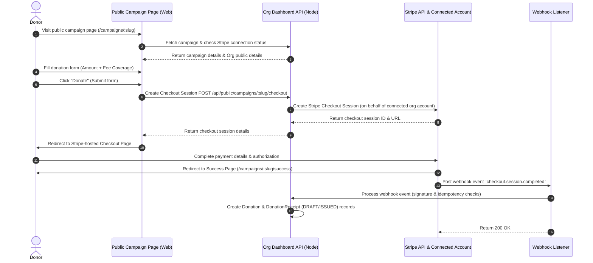

# Phase 2 Specification: Campaign Pages & Stripe Connect Payments

This specification defines the product features, payment architecture, data models, webhooks, and security constraints for Phase 2 of the S4NP nonprofit fundraising vertical.

---

## 1. Product Objective

To transform Magnus Accord from an internal database and operations CRM into an active fundraising engine. This phase enables nonprofits to connect their own Stripe accounts, publish public campaign pages, and collect secure donations online where the funds flow directly to the nonprofit’s merchant account.

---

## 2. Non-Goals

- Processing card payments through a central Magnus Accord Stripe account (each nonprofit must use Stripe Connect).
- Auto-refunding donations via the dashboard or autonomous agent refund actions (refunds must be performed manually in the Stripe Dashboard for this phase).
- Dynamic multi-currency checkout on the same campaign (each campaign has a single designated default currency).
- Multi-party payouts or fee-splitting (100% of donation flows directly to the connected account, minus Stripe processing fees).
- Full Stripe Connect dashboard embedded in the application (rely on Stripe-hosted Express/Custom dashboard links).

---

## 3. Payment Flow Diagram



---

## 4. Data Models

We need to add models for Stripe integration and public campaigns to our schema.

### 4.1. Updated/New Database Models (Prisma Syntax)

```prisma
model Organization {
  // Existing fields ...
  stripeConnectId      String?   @unique // The connected Stripe account ID (e.g. acct_...)
  stripeOnboardingDone Boolean   @default(false)
  campaigns            Campaign[]
}

model Campaign {
  id           String        @id @default(uuid())
  orgId        String
  organization Organization  @relation(fields: [orgId], references: [id])
  name         String
  slug         String        @unique // URL slug (e.g. "summer-drive-2026")
  description  String?
  goalAmount   Decimal?      @db.Decimal(12, 2)
  currency     String        @default("USD")
  isActive     Boolean       @default(true)
  createdAt    DateTime      @default(now())
  updatedAt    DateTime      @updatedAt
  donations    Donation[]

  @@index([orgId])
  @@index([slug])
}

model Donation {
  // Existing fields updated to support checkout session link and campaign linkage:
  campaignId         String?
  campaign           Campaign?      @relation(fields: [campaignId], references: [id])
  stripePaymentIntentId String?     @unique // e.g. pi_...
  stripeCheckoutSessionId String?   @unique // e.g. cs_...
  feeCovered         Decimal        @default("0.00") @db.Decimal(12, 2) // Extra amount paid to cover fees
  // ... other existing fields (amount, status, donorId, etc.)
}

model StripeWebhookEvent {
  id         String   @id @default(uuid())
  eventId    String   @unique // Stripe event ID (evt_...) to guarantee idempotency
  processed  Boolean  @default(false)
  createdAt  DateTime @default(now())
}
```

---

## 5. API Endpoints

### 5.1. Private Administration Endpoints (Require Auth & Org Scope)
- `POST /api/org/stripe/connect`: Initiate Stripe Connect Express onboarding. Returns a Stripe account link URL.
- `GET /api/org/stripe/status`: Check Connected Account capabilities (charges_enabled, payouts_enabled).
- `POST /api/org/campaigns`: Create a new fundraising campaign.
- `GET /api/org/campaigns`: List campaigns for the authenticated organization.
- `PATCH /api/org/campaigns/:id`: Update campaign properties (name, description, goal, status).

### 5.2. Public Endpoints (No Auth Required)
- `GET /api/public/campaigns/:slug`: Fetch public details of a campaign (name, goal, amount raised so far, and nonprofit public info).
- `POST /api/public/campaigns/:slug/checkout`: Create a Stripe Checkout Session on behalf of the connected account. Takes amount, donor email, donor name, and fee-coverage flag.
- `POST /api/public/stripe/webhook`: Root webhook handler to process Stripe events. Exposes raw body for signature verification.

---

## 6. Web Routes

- `/app/settings/stripe`: Organization configuration dashboard to link and manage their connected Stripe account.
- `/app/campaigns`: Campaign administration screen to view stats, create campaigns, and copy public links.
- `/campaigns/:slug`: Public donation page optimized for mobile and desktop checkout.
- `/campaigns/:slug/success`: Public confirmation page displaying donor thank-you and pending receipt status message.

---

## 7. Stripe Connect Onboarding Flow

1. **Initiation**: The nonprofit clicks "Connect Stripe" on the settings dashboard.
2. **Account Creation**: Magnus backend invokes `stripe.accounts.create({ type: 'express' })` and associates the resulting `acct_xxx` with the organization.
3. **Onboarding Redirection**: Backend creates a link via `stripe.accountLinks.create` directing the user to the Stripe Express onboarding flow.
4. **Completion**: Stripe redirects the user back to the Magnus dashboard (`/app/settings/stripe?status=success`). The backend queries Stripe to update `stripeOnboardingDone` if `charges_enabled` returns true.

---

## 8. Webhook Event Handling

The webhook handler at `/api/public/stripe/webhook` must perform:
1. **Signature Verification**: Validate payload authenticity using the Stripe webhook signing secret.
2. **Idempotency Guard**: Check `StripeWebhookEvent` table for `evt_xxx`. If already processed, return `200 OK` instantly to ignore duplicate deliveries.
3. **Event Routing**:
   - `checkout.session.completed`:
     1. Retrieve the session details.
     2. Lookup the campaign by `campaignId` stored in session metadata.
     3. Lookup or create the `Donor` record using the customer email.
     4. Create the `Donation` record containing the exact amount, fee coverage detail, and campaign association.
     5. Automatically generate and issue a `DonationReceipt` if configured.
4. **Fail-Safe Logging**: Record processed events to the audit table in a single transaction database commit.

---

## 9. Donor Fee Coverage Formula

To ensure the nonprofit receives 100% of their intended donation amount, the checkout session must calculate the total amount to charge if the donor opts to cover the fees.

Stripe's standard fee structure is **2.9% + $0.30**.
To recover this fee exactly:

$$\text{Gross Charge} = \frac{\text{Net Donation} + \text{Fixed Fee}}{1 - \text{Percentage Rate}}$$

For USD:

$$\text{Gross Charge} = \frac{\text{Net Donation} + 0.30}{1 - 0.029} = \frac{\text{Net Donation} + 0.30}{0.971}$$

### Example Calculation
If a donor donates **$100.00** and opts to cover the fee:
- $\text{Gross Charge} = (100.00 + 0.30) / 0.971 = 103.30$
- The total charged is **$103.30**.
- Stripe fee = $103.30 \times 0.029 + 0.30 = 2.9957 \approx 3.00$.
- Nonprofit receives = $103.30 - 3.00 = 100.30$ (covers the full donation amount plus rounding variation).

The backend calculates this on checkouts to dynamically set the Stripe Checkout line item amount, recording the `$3.30` as `feeCovered`.

---

## 10. Security Risks & Mitigations

| Risk | Mitigation |
| :--- | :--- |
| **Open Redirects via Checkout Success URLs** | Harden Stripe session parameters by enforcing strict whitelist validations on redirect hosts, matching only the verified production or local app domain. |
| **Org Context Bypass (Cross-Tenant Leakage)** | Verify Stripe connected account ID (`stripeConnectId`) matches the campaign's organization `stripeConnectId` during Checkout Session creation. |
| **Campaign Slug Spoofing / Host Takeovers** | Validate campaign slug matches alphanumeric/hyphen characters and exists in DB before sending requests to Stripe. |
| **Falsified Payment Confirmations** | Never trust client redirect parameters to record donations. Only allow the cryptographically signed `checkout.session.completed` webhook to write or mutate donation data. |
| **Formula Injection via Metadata** | Sanitize all metadata (donor name, message) stored on Stripe records to prevent CSV extraction exploits in the Stripe dashboard exports. |

---

## 11. Test Plan

### 11.1. Automated Tests
- **Onboarding Tests**: Mock Stripe Express endpoints and verify account links are constructed with valid parameters.
- **Math Verification**: Unit tests asserting the Fee Coverage Formula produces accurate gross charge figures across multiple test cases (e.g. $10, $50, $1000).
- **Idempotency Verification**: Run mock webhook events in parallel to confirm only a single `Donation` record is created for a given Stripe Event ID.
- **Tenant Validation**: Confirm that querying campaigns or executing checkouts on incomplete or cross-org connected Stripe IDs fails closed.

### 11.2. Stripe Test Mode Manual Execution
- Test Stripe Connect flow using Stripe Express dummy accounts.
- Complete successful and failed checkouts using test cards (e.g. `4242...`).
- Verify mock webhook deliveries trigger the automatic generation of database donation ledgers.

---

## 12. Definition of Done

- Nonprofits can onboard via Stripe Connect and check onboarding state inside settings.
- Public campaign landing pages render details dynamically by looking up valid campaign slugs.
- Checkout redirect handles both default donations and gross calculations for fee coverage.
- Stripe Webhook handles signature checks, prevents double processing via idempotency checks, and creates accurate `Donation` records.
- All integration and unit tests pass with coverage exceeding 85%.

---

## 13. Rollback Plan

- If Stripe API experiences critical connection dropouts or breaking SDK issues, the system can fallback to a disabled-checkout mode where the "Donate" button redirects to an offline check mailing instructions panel.
- Schema migrations include structural columns (`stripeConnectId`, `stripeCheckoutSessionId`) that do not alter core user auth models, allowing safe reversion of code commits without data loss on critical tables.
