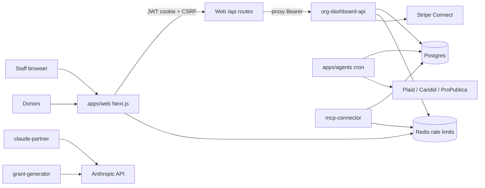

# Technical Landscape Exploration — Magnus Accord

**Date:** 2026-08-18  
**Scope:** Architectural design, functional capabilities, deployment costs, security postures, and ecosystem maturity  
**Primary subject:** `magnus-non-profit-services` (Magnus Accord / Magnus Non Profit Services)  
**Status of product under study:** Pilot/Staging Verification in progress; **Production Certification: Not Yet Approved** (as of 2026-06-11 release truth)

This document synthesizes in-repo product truth, code architecture, staging evidence, and the adjacent nonprofit-software market. It is an exploration brief for operators and product strategy—not a production certification.

**Canon when docs disagree:** prefer `README.md`, `docs/product/MAGNUS_ACCORD_*`, `docs/operations/P0_PRODUCTION_HARDENING_*`, and current code over April-era `AUDIT_REPORT.md` stop-ship claims that have since been remediated.

---

## Executive verdict

Magnus Accord sits in a **category gap** most nonprofit stacks leave open: a **bounded AI operations layer** that watches, drafts, and prepares compliance/board/grant/financial work while humans retain authority over anything external or irreversible. Adjacent markets (donor CRM, grant management, fund accounting, board portals) are mature and fragmented; few products combine Tier-A autonomous prep with honest autonomy red lines.

Architecturally, the monorepo is a **multi-service Node/TypeScript spine** on Postgres + Redis, with Railway as the evidenced staging topology. Functionally, the HQ Autonomous Ops surfaces and GROWTH/ENTERPRISE agent set are real in-repo; public connector ecosystem, semantic memory, and Tier-B approval UX are not. Deployment cost for a private pilot is dominated by always-on Railway services plus Anthropic/Stripe/Plaid usage—not by list-price SaaS packaging (which is capability-defined, not dollar-priced in-repo). Security posture has moved past the April grade-D audit narrative for several critical controls, but **GA remains blocked** by observability wiring, staging payment smoke, and remaining honesty gates.

---

## 1. Architectural design

### 1.1 System shape

Magnus Accord is a **pnpm monorepo** (`pnpm@10.29.3`) with eight runtime apps and six shared packages:

| Layer | Components | Role |
|-------|------------|------|
| Staff UX | `apps/web` (Next.js) | Authenticated shell, public campaign pages, BFF proxy to org API |
| Data plane API | `apps/org-dashboard-api` (Express) | Authoritative org-scoped HTTP API |
| Autonomous Ops | `apps/agents` (node-cron) | Scheduled persona agents writing runs/alerts/handoffs/memory |
| Platform billing | `apps/billing` | Stripe subscription billing (platform), separate from Connect fundraising |
| AI surfaces | `apps/claude-partner`, `apps/grant-generator` | Org Claude integration; internal grant drafting |
| Operator tools | `apps/mcp-connector` | Internal MCP tool server (JWT + audit + rate limits) |
| Deferred | `apps/worker-financial-layer` | Worker income/tax APIs; fail-closed by feature flag |
| Shared | `@magnus/db`, `auth`, `config`, `subscription`, `org-autonomous-ops-context`, `observability` | Prisma/encryption, JWT, Zod env, entitlements, AO domain builders, hooks |

**Platform invariants** (`.agent/workflows/magnus-platform-invariants.md`):

- DB access only via `@magnus/db` (no ad-hoc Prisma clients outside the package).
- Agent logic must include idempotency and dedupe keys.
- Feature gating must be back-end enforced.

### 1.2 Tenancy and data model

- **Tenant root:** `Organization` (unique EIN; subscription tier/status; Claude status; encrypted Plaid token; Stripe ids).
- **Schema scale:** ~43 Prisma models in `packages/db/prisma/schema.prisma` (~1.1k lines), covering compliance/grants/workers, Autonomous Ops (runs, alerts, handoffs, three memory tiers, org context files), and S4NP (donors, donations, receipts, campaigns, Stripe Connect, funds/ledger, concierge proposals).
- **Tenancy pattern:** domain tables carry `orgId` with cascade; APIs re-bind JWT `orgId`; MCP paths use EIN ↔ membership checks.
- **Field encryption:** AES-256-GCM Prisma extension for sensitive fields (`plaidAccessToken`, `ssnEncrypted`) when `ENCRYPTION_KEY` is set.

### 1.3 Auth and request path

- **Custom JWT** (not Clerk / Google OAuth): web cookie sessions + CSRF (`X-Magnus-CSRF` + Origin vs `NEXT_PUBLIC_APP_URL`); APIs use Bearer JWT via `@magnus/auth` with issuer/audience binding.
- Browser traffic is intended to hit **same-origin `/api/org/*`** on web, which proxies to `ORG_DASHBOARD_API_BASE_URL` (fail-closed `501` if unset).
- Staging JWT alignment documented as `JWT_ISSUER=magnus-accord-staging`, `JWT_AUDIENCE=magnus-accord-private-pilot`.

### 1.4 Autonomous Ops architecture

| Persona (roadmap) | Stable `agentName` | Schedule (indicative) | Tier gate |
|-------------------|--------------------|------------------------|-----------|
| STEWARD | `ComplianceWatchdog` | Nightly | GROWTH+ |
| ORACLE | `BoardIntelligenceOracle` | Weekly | GROWTH+ |
| SENTINEL | `FinancialSentinel` | Daily | ENTERPRISE |
| HERALD | `GrantLifecycleManager` + `GrantIntelligenceHerald` | Daily / weekly | ENTERPRISE |
| SOLARIS | *(not implemented)* | — | Stage 2+ |
| *(internal)* | `WorkerIncomeOptimizer` | Not nonprofit-tier scheduled | INTERNAL_ONLY |

**Autonomy red lines** (`docs/AUTONOMOUS_OPS_ROADMAP.md`):

| Tier | Meaning | Current agents |
|------|---------|----------------|
| A | Internal artifacts without approval | **All shipped agents** |
| B | Ask first (external send, filing state, submissions) | Not productized as UX |
| C | Never autonomous (money movement, gov filing, grant submit) | Platform-forbidden |

Kill switches: `AGENTS_ENABLED` plus per-agent env flags; eligibility also requires `subscriptionStatus === ACTIVE` and tier allow-lists in `packages/subscription/src/autonomousOpsPolicy.ts`.

### 1.5 Integration architecture

| Integration | Architectural role | Product exposure |
|-------------|--------------------|------------------|
| Stripe (platform + Connect) | Billing + campaign checkout/webhooks | GROWTH+ campaigns; staging smoke blocked on placeholder test secret |
| Anthropic / Claude | Partner API, grant drafting, concierge | LIMITED / gated |
| Plaid | Financial watch / MCP finance tools | INTERNAL_ONLY |
| Candid | Funder research / grant intelligence | INTERNAL_ONLY |
| ProPublica | Filing history MCP tool | Operator MCP |
| Slack outbound | Alert delivery | NOT_IMPLEMENTED |
| MCP transport | Operator tool execution | INTERNAL_ONLY |

### 1.6 Deployment topology (evidenced)

Preferred staging platform: **Railway** (`docs/operations/P0_PRODUCTION_HARDENING_STAGING_SMOKE_*`).

Documented staging services:

- `accord-web-staging`
- `accord-org-dashboard-api-staging`
- `accord-mcp-connector-staging`
- `accord-postgres-staging`
- `accord-redis-staging`
- Domain: `https://staging.magnusnonprofitservices.com`

Also referenced historically: Neon Postgres, Vercel (web), Render (API) in `docs/STAGING_RUNBOOK.md`.

**Architecture gap:** Railway staging evidence does **not** show deployed `agents`, `billing`, `claude-partner`, `grant-generator`, or `worker-financial-layer`. A full Assisted Ops pilot that includes scheduled watch requires deploying `apps/agents` separately.

---

## 2. Functional capabilities

### 2.1 Product positioning (what it is)

Magnus Accord is a **bounded nonprofit operations layer**: software and scheduled internal agents **watch, draft, flag, and prepare** work. People keep authority over sending, filing, submissions, money movement, and authoritative external record changes (`docs/product/MAGNUS_ACCORD_PRODUCT_POSITIONING.md`).

It is **not** positioned as:

- A full Salesforce/Blackbaud replacement CRM suite
- An autonomous filing/submission engine
- A self-serve public MCP/connector marketplace
- A native mobile app (web-responsive only)

### 2.2 Capability maturity (repo taxonomy)

| Label | Meaning |
|-------|---------|
| LIVE | Implemented and usable when deployed + entitled |
| PILOT | Exposed with explicit pilot labeling |
| LIMITED | Real but narrower than the long-term story |
| INTERNAL_ONLY | Operator/worker-scoped; not HQ client product |
| NOT_YET_AVAILABLE / Scaffolded / Deferred | Missing or incomplete |

**Strong LIVE spine (when deployed):**

- Org-scoped APIs: overview, compliance calendar, grants, AO identity files, handoffs, memory, control tower, alerts, obligations, donor/volunteer events
- Scheduled agents (Growth/Enterprise per policy)
- Web AO surfaces: directory, connectors (honest status), rules, readiness, executive, control tower
- S4NP vertical models: donor CRM, campaigns/Connect, fund accounting lite, AI Concierge proposals (HITL)

**Materially constrained:**

- Claude Partner (status-gated; enablement not pure self-serve)
- Volunteer module = time ledger only (no roster/in-kind/scheduling truth)
- Tier 3 semantic memory = keyword substring search, not embeddings
- Many staff UIs for alerts/handoffs/donor/volunteer remain API-only

**Out of launch packaging:**

- MCP, Grant Generator, Worker Financial as public connectors
- SOLARIS reflection agent
- Slack outbound
- Tier B ask-first approval UX
- Audit workstation / export pack
- Mobile native

### 2.3 Commercial packages (capability, not price list)

| Offer | Tier | Core include |
|-------|------|--------------|
| Core | STARTER | `donor_crm`, `campaigns`, `compliance_calendar` — **no** scheduled agents |
| Assisted Ops Pilot | GROWTH | ComplianceWatchdog + BoardIntelligenceOracle; AO web; Connect campaigns; fund lite; concierge; grant_generator key |
| HQ Expansion | ENTERPRISE | + FinancialSentinel, GrantLifecycleManager, GrantIntelligenceHerald; `claude_partner`, `agents_layer`, institutional flag reserved |

Source: `packages/subscription/src/policy.ts`, `docs/product/MAGNUS_ACCORD_PACKAGES.md`.

### 2.4 S4NP vertical (fundraising / finance adjacent)

Four phased specs under `docs/product/S4NP_PHASE_*` with verification evidence (explicitly **not** GA approval):

1. Donor CRM + receipts  
2. Campaigns + Stripe Connect  
3. Fund accounting lite (funds, CoA, double-entry, allocations)  
4. AI Concierge (`ConciergeProposal` HITL; no autonomous ledger mutation)

This is how Magnus overlaps CRM/fundraising/accounting markets without claiming to be a full ASC 958 ERP.

---

## 3. Deployment costs

In-repo docs define **capability packages**, not SaaS list prices. Costs below are **operator cost models** from evidenced topology + published vendor rates (2026-08). Treat as planning ranges, not invoices.

### 3.1 Hosting — Railway (preferred staging)

Published Railway model ([docs.railway.com/pricing](https://docs.railway.com/pricing)):

| Plan | Subscription (also usage credit) |
|------|----------------------------------|
| Hobby | $5/mo |
| Pro | $20/mo per workspace |
| Enterprise | Custom |

Resource rates (approx.): **$20/vCPU-mo**, **$10/GB RAM-mo**, **$0.05/GB egress**, **$0.15/GB-mo volume**.

**Private pilot minimum (matches staging evidence):** web + org-dashboard-api + Postgres + Redis (+ optional mcp-connector).

| Scenario | Services | Rough monthly compute band |
|----------|----------|----------------------------|
| A — Smoke / private pilot | web, API, Postgres, Redis | **~$40–120** on Pro after credit (light always-on) |
| B — Assisted Ops pilot | A + `agents` worker | **~$60–180** (cron is bursty; DB I/O rises with org fan-out) |
| C — Full internal AI stack | B + claude-partner + grant-generator + mcp-connector | **~$100–300+** compute alone before LLM spend |

Notes:

- Each Railway service is billed independently; multi-service topologies dominate cost more than the $20 Pro fee.
- Older runbooks mention Neon/Vercel/Render splits—those change the mix (edge web vs always-on API) but not the need for shared Postgres + Redis for production-safe rate limiting.

### 3.2 External API / usage drivers

| Driver | Where it burns | Pricing signal (external, 2026-08) |
|--------|----------------|-------------------------------------|
| **Anthropic** | claude-partner, grant-generator, concierge | Claude Sonnet 5 API ~**$2 / MTok in**, **$10 / MTok out** (list); nonprofit Team/Enterprise discounts up to ~75% via Claude for Nonprofits (plan seats—not a substitute for API metering discipline) |
| **Stripe** | Connect donations + platform billing | Documented fee-coverage formula **2.9% + $0.30** in S4NP Phase 2 spec; volume-driven |
| **Plaid** | FinancialSentinel / MCP finance | Contract pricing; cost only when ENTERPRISE financial watch is enabled |
| **Candid** | Grant intelligence / funder tools | API subscription; ENTERPRISE/internal grant paths |
| **ProPublica** | Filing history | Typically low relative to LLM |
| **Sentry** | Error tracking when `SENTRY_DSN` set | Plan-dependent |

**Dominant variable cost for AI-assisted pilots is Anthropic token volume**, especially board packets, grant drafts, and concierge proposals. Agents that only persist structured alerts without large prompt contexts stay cheaper than chat-heavy Claude Partner usage.

### 3.3 Engineering / remediation cost (not hosting)

Historical audit remediation estimate: **20–28 person-days** to a defensible paid launch (`AUDIT_REPORT.md`, April 2026). Subsequent P0 hardening waves closed many of those items; remaining GA cost is better framed as **narrow gates** (observability wiring, Stripe test-secret smoke, agents deploy for watch pilots, doc drift cleanup) rather than a full rewrite.

### 3.4 Cost posture vs category peers (directional)

| Category peer | Typical buyer cost pattern | Magnus relative posture |
|---------------|----------------------------|-------------------------|
| Instrumentl / grant suites | ~$179+/mo SaaS seats | Magnus does not replace deep grant prospecting DB; lower seat SaaS, higher custom-ops cost |
| Bloomerang / Givebutter | CRM/fundraising SaaS | Magnus S4NP overlaps lightly; not a donor CRM competitor at feature parity |
| Sage Intacct / Blackbaud FE | Fund accounting ERP | Magnus fund-accounting-lite is intentionally shallow |
| Salesforce Nonprofit Cloud | High implementation ($30k–$100k+ cited in market guides) | Magnus is lighter, AI-ops-first, not CRM-platform-first |
| Claude for Nonprofits connectors | Discounted Claude + Blackbaud/Candid/Benevity MCP | Overlaps Magnus’s Anthropic+Candid direction; Magnus differentiates with **org-scoped Autonomous Ops + autonomy tiers** |

---

## 4. Security postures

### 4.1 Threat model (product-relevant)

Highest-likelihood classes for this stack (`AUDIT_REPORT.md` §0, still valid as threat framing):

1. **Broken access control / cross-tenant reads** via free-form IDs  
2. **Secret leakage** into logs, web bundles, or model prompts  
3. **Fabricated compliance/finance presented as truth** (board-trust failure)  
4. **Prompt / tool injection** through grants, org identity, MCP params  
5. **Excessive agent autonomy** if scoping or gates fail  

### 4.2 Historical vs current control state

| Control | April 2026 audit claim | Current tree / P0 baseline (2026-06+) |
|---------|------------------------|----------------------------------------|
| Production readiness grade | **D** | **Not GA-certified**; several critical remediations landed |
| MCP server | Health-only; tools unmounted | Tools mounted with helmet, JWT, subscription gate, audit, Redis rate limit |
| Finance fabrication | `Math.random()` fallbacks | FinancialService forbids fabricated values; fail-closed semantics |
| Worker financial placeholders | Truth-bearing zeros | Feature-flag fail-closed `503` |
| Web security headers | Missing CSP/HSTS/frame | Present in `apps/web/next.config.js` |
| CSRF | Absent | Cookie mutations + Origin / CSRF header path |
| Rate limiting | Memory-only | Redis-backed; **production requires `REDIS_URL` (fail-closed)** |
| Field encryption | Claimed but weak evidence | Prisma encryption extension for sensitive fields |
| Observability | Weak | Package exists; **app wiring still a stated P0** |
| Auth provider | No Clerk/OAuth | Still custom JWT (V2 IdP evaluation deferred) |

**Honesty rule:** treat April `AUDIT_REPORT.md` and unreconciled sections of `BLOCKERS_TO_PRODUCTION.md` as **historical**. Operator truth lives in README + P0 baseline + staging smoke results.

### 4.3 Current residual risk (pilot-relevant)

| Risk | Severity | Mitigation / status |
|------|----------|---------------------|
| Production Certification not approved | Gate | Private pilot only; checklist-gated |
| Observability not wired into app entrypoints | P0 | Wire `@magnus/observability` or document equivalent |
| Stripe enterprise checkout smoke blocked (placeholder test secret) | Staging | Replace with real Stripe test secret; rerun smoke |
| Agents not evidenced on Railway staging | Ops | Deploy agents only when watch is in scope; validate `AGENTS_ENABLED` + alert sink |
| Grant-generator prompt mediation of tokens (historical high risk) | High if enabled | Keep grant-generator **internal**; prefer trusted-code tool calls over model-mediated secrets |
| Custom JWT vs enterprise IdP | Medium (enterprise sales) | Acceptable for private pilot; plan V2 evaluation |
| Doc drift overstating readiness | Trust | Prefer maturity map + production truth checklist |
| External pentest | Deferred | Prep packs exist; not a live external pentest substitute |

### 4.4 Security posture summary

For a **private pilot with Redis, CSRF, headers, mounted MCP (operator-only), and fabrication removed**, the posture is **defensible for gated staging use**. It is **not** yet a board-grade GA posture: observability, payment smoke, and remaining honesty/ops gates remain. Public exposure of MCP or worker financial remains explicitly out of scope.

---

## 5. Ecosystem maturity

### 5.1 Magnus Accord maturity (internal)

| Dimension | Assessment |
|-----------|------------|
| Repo / CI | Mature for stage: GitHub Actions CI (install, TruffleHog, lint, Prisma, build, typecheck, tests, migration validate, MCP Docker) |
| Product truth docs | Strong and unusually honest (maturity map, feature directory, packages, connector registry, action matrix) |
| Autonomous Ops HQ spine | High relative to peers for **bounded agent ops**; Stage 0–2 largely in motion; Stages 3–4 incomplete |
| S4NP fundraising vertical | Models + verification evidence; staging payment path incomplete |
| Connector ecosystem | **Immature for self-serve**—one client-visible panel (`claudePartner`); most connectors INTERNAL_ONLY |
| Ops / staging | Real Railway staging with smoke plan/results; agents/billing not in evidenced set |
| Mobile | Not shipped |
| Production certification | **Not approved** |

Roadmap stage view: foundation and internal autonomous prep are the live center of gravity; commercial packaging and executive/portfolio synthesis remain ahead.

### 5.2 Adjacent nonprofit software market (2026)

Market guides describe a **fragmented four-stack** reality: donor CRM, grant management, fundraising, and accounting—most orgs run 3–4 tools because no single platform covers everything.

| Segment | Representative products | Where Magnus overlaps / differs |
|---------|-------------------------|----------------------------------|
| Donor CRM | Bloomerang, Neon CRM, DonorPerfect, Salesforce NPSP | S4NP Phase 1 is a lite CRM; not relationship-marketing depth |
| Fundraising / payments | Givebutter, Stripe-native tools | Phase 2 Connect campaigns; fee math explicit |
| Grant lifecycle | Instrumentl, AmpliFund, GrantVantage, Fluxx | Magnus focuses on **watch + prep**, not full post-award compliance ERP |
| Fund accounting / ERP | Sage Intacct, Blackbaud FE NXT, Aplos, QuickBooks Nonprofit | Fund-accounting-lite only; not ASC 958 statement engine |
| Board / governance | BoardEffect and peers | BoardIntelligenceOracle prep packets; not a board portal suite |
| AI for nonprofits | Claude for Nonprofits (Blackbaud/Candid/Benevity connectors), Instrumentl AI drafting | Closest strategic adjacency: LLM + nonprofit data; Magnus differentiates with **org tenancy, subscription gates, Tier A/B/C autonomy, and scheduled HQ agents** |

**Strategic implication:** sell Magnus as the **AI ops / headquarters visibility layer** that sits beside CRM/accounting—not as a rip-and-replace of Blackbaud or Sage.

### 5.3 Magnus product family (ecosystem adjacency)

Public GitHub under the same owner shows additional Magnus-branded surfaces:

| Repo | Stated focus | Maturity signal |
|------|--------------|-----------------|
| `magnus-non-profit-services` | Accord / nonprofit AI ops platform | **Most mature**—monorepo, Prisma, CI, Railway staging, extensive truth docs |
| `Magnus-Eye-of-Horus-v1` | Compliance / regulatory audit playbook | AI Studio-style TypeScript prototype |
| `Magnus-Omni_SaaS` | CRM interface / plugin | AI Studio prototype (Gemini) |
| `Magnus-Procura` | Procurement / sourcing | AI Studio prototype |
| `Magnus_White-_Label` | Reseller marketplace | AI Studio prototype |
| `magnus-sales-os` | (prior agent target) | **Not accessible** to automation (404 / private); unfinished clone attempt |

**Family maturity reading:** Accord is the production-oriented spine; sibling repos look like early AI Studio experiments without Accord’s tenancy, subscription, or ops rigor. Unifying them into one platform would be a **portfolio architecture** problem (shared auth/tenancy/brand), not a merge-ready monorepo today.

### 5.4 Ecosystem maturity scorecard

| Area | Score (1–5) | Notes |
|------|-------------|-------|
| Core AO architecture | 4 | Clear spine, invariants, honest autonomy model |
| Functional depth vs CRM/ERP peers | 2.5 | Strong niche; shallow in classic nonprofit modules |
| Deployability / staging | 3.5 | Real Railway evidence; incomplete service set |
| Cost predictability | 3 | Hosting model clear; LLM usage is the swing factor |
| Security readiness for private pilot | 3.5 | Hardened vs April; GA gates remain |
| Security readiness for public GA | 2 | Certification not approved; observability + smoke gaps |
| Public connector / partner ecosystem | 1.5 | Intentionally constrained; do not market as ecosystem |
| Documentation / release honesty | 5 | Unusual strength vs typical early SaaS |
| Cross-Magnus product cohesion | 2 | Shared brand; weak shared platform |

---

## 6. Decision guidance

### If the goal is a private Assisted Ops pilot

1. Deploy **Postgres + Redis + web + org-dashboard-api**; add **agents** only if scheduled watch is promised.  
2. Keep MCP / grant-generator / worker-financial **internal**.  
3. Budget **~$60–180/mo** hosting for a light pilot plus Anthropic usage caps.  
4. Gate claims with the maturity map and production truth checklist—not marketing language.

### If the goal is Enterprise HQ Expansion

1. Prove FinancialSentinel / grant agents against real Plaid/Candid (or fail closed).  
2. Complete Stripe test smoke; wire observability.  
3. Expect higher variable cost (LLM + banking APIs) and stricter board-trust controls on financial narratives.

### If the goal is market expansion / platform family

1. Treat Accord as the **shared tenancy + AI ops kernel**.  
2. Do not imply Omni/Procura/White-Label/Eye-of-Horus share Accord’s security or data plane until explicitly integrated.  
3. Resolve access to `magnus-sales-os` (or correct repo name) before claiming a sales OS layer.

### Explicit non-claims (carry forward)

- No autonomous email, grant submission, government filing, or money movement.  
- No production connector marketplace.  
- No GA / production certification as of the current release truth.  
- No native mobile product.

---

## 7. Sources

### In-repo (primary)

- `README.md`, `AUDIT_REPORT.md`, `BLOCKERS_TO_PRODUCTION.md`
- `docs/product/MAGNUS_ACCORD_{PRODUCT_POSITIONING,MATURITY_MAP,PACKAGES,FEATURE_DIRECTORY,CLIENT_FEATURE_MATRIX,CONNECTOR_REGISTRY,ACTION_MATRIX}.md`
- `docs/AUTONOMOUS_OPS_ROADMAP.md`, `docs/AUTONOMOUS_OPS_HANDOFF_AND_MEMORY.md`
- `docs/operations/P0_PRODUCTION_HARDENING_{BASELINE,STAGING_SMOKE_PLAN,STAGING_SMOKE_RESULTS}.md`
- `docs/operations/DEPLOYMENT_HARDENING_SUMMARY.md`, `docs/STAGING_RUNBOOK.md`
- `packages/subscription/src/{policy,features,autonomousOpsPolicy}.ts`
- `packages/db/prisma/schema.prisma`
- App entrypoints under `apps/*`

### External (market / pricing context)

- Railway pricing docs (2026): https://docs.railway.com/pricing  
- Anthropic Claude API pricing / Claude for Nonprofits program materials (2026)  
- Nonprofit software landscape guides (GrantPipe full-stack 2026; Clearpick nonprofit software guide; Instrumentl / Submit.com grant management overviews; ERP Research nonprofit ERP guide)

---

## 8. Open follow-ups

1. Reconcile remaining stop-ship language in `BLOCKERS_TO_PRODUCTION.md` with post-hardening code so operators have a single current gate list.  
2. Obtain or confirm `magnus-sales-os` (or successor) for a second-pass landscape that includes go-to-market tooling.  
3. Produce a dollarized pilot TCO worksheet once Railway usage metrics and Anthropic token telemetry from staging are available.  
4. Optional competitive deep-dives (Instrumentl, GrantPipe, Claude for Nonprofits connectors) if sales needs battle cards beyond this brief.
